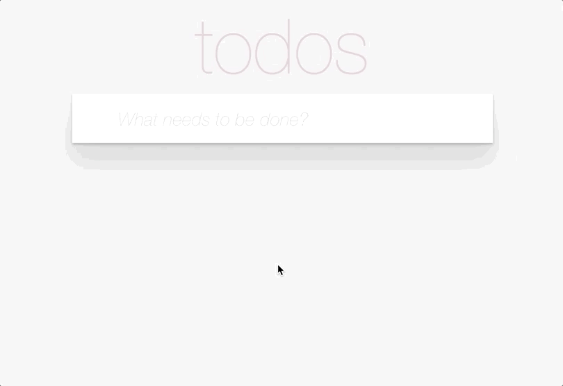

# TODO App

The ToDo App with React and Sass is a dynamic and user-friendly task management application that streamlines your daily organization. Developed using the powerful combination of React for frontend functionality and Sass for enhanced styling, this app offers a seamless and visually appealing user experience.

## Technologies Used
The Landing Page was built using the following technologies:

### -React
### -SASS

## [DEMO LINK](https://zibi95.github.io/react_todo-app-with-api/)

## Features
1) Ability to add a todo using input
2) Ability to remove a todo using the `destroy` button (`X`)
3) Ability to switch between `All`/`Active`/`Completed` todos
4) Add ability to clear completed todos - remove all completed items from the list
5) Inline editing for the TODO item
  - double click on the TODO title makes it editable
  - `Enter` saves changes
  - `Ecs` cancels editing
  - Todo title can't be empty! If a user presses `Enter` when the title is empty, this todo should be removed.
  - save changes `onBlur`
7) Ability to toggle the completed status of all the todos with the `toggleAll` checkbox.
